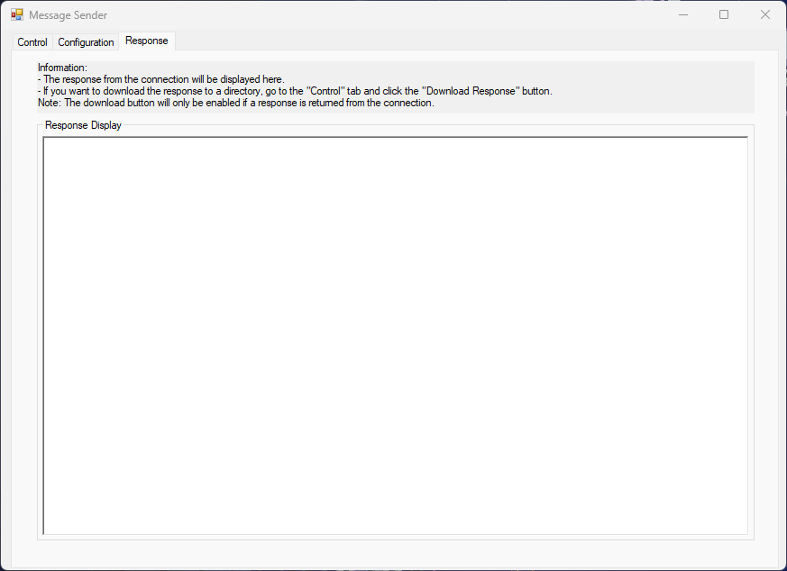

# MessageSender
## Introduction
MessageSender is a C# Windows Form application. It is a simple application that acts as the client and sends requests to different connection types/communication protocols and displays the response.

## Structure
The entire repository is a Visual Studio project solution. There are 8 projects in it.

The solution file can be found in `MessageSender` folder.

The projects can be categorised in two groups. One is the MessageSender application, and the other is the different connection types/communication protocols.

The structure is displayed below:
- Solution
  - CommunicationProtocols
    - HttpSocket
      - `HttpSocketFile` (Project)
      - `HttpSocketMessage` (Project)
    - Socket
      - `SocketAsyncFile` (Project)
      - `SocketAsyncMessage` (Project)
      - `SocketSyncFile` (Project)
      - `SocketSyncMessage` (Project)
    - `HttpRestApi` (Project)
  - `MessageSender` (Main Project) (Solution file found here)

## MessageSender UI
### Control Tab
This tab is where you can control the
- Connection type you want (Socket, HttpSocket, HTTP or AWS)
- Additional information for your request (e.g. Custom Http Headers or AWS token)
- Preparing the connection
- Preparing which data to send (Message or File; the Content Types)
- The sending method (sending message synchronously or asynchronously)
- Download response as text files to a directory of your choice

Below shows an image of the Control tab:

  

### Configuration Tab

Below shows an image of the Configuration tab:
This tab is where you can configure the
- Directory of where the logs will be saved at
- Host connection which is the identifier of where you want the request to do (Note: Secure True is HTTPS , and Secure False is HTTP)
- AWS information (Note: This is not tested properly)
- HTTP information which customises the endpoint, method and headers

Note: To customise HTTP or AWS request, you need to make sure to `✓` the appropriate checkbox in the `Control` tab under the `Include Addition Information Into Connection` section

  

### Response Tab
This tab is just reponsible for displaying the body of the response received.

Below shows an image of the Response tab:

  

## How It Works
For the different data preparation types (Message and File), it converts the text/files into a byte stream, appends them into the request body and uses the HttpWebRequest class to send the request and receive the response.
In the `CommunicationProtocols` folder, there are some examples that you can follow to get a head start.

## Closing Thoughts
While I think this simple application is `mostly functional`. I still think that many things can be improved and there are `probably bugs` lying around somewhere.